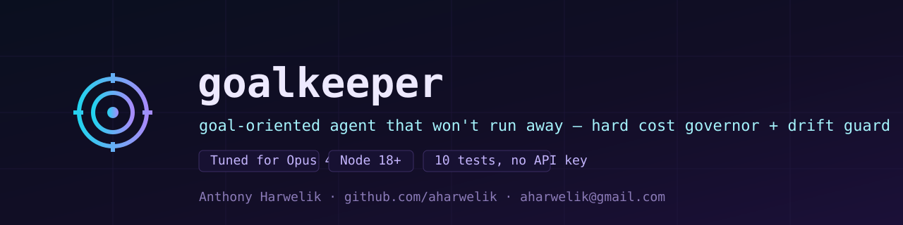

<p align="center">
  
</p>

<p align="center">
  
  
  
  
</p>

# goalkeeper

A goal-oriented autonomous agent that **physically cannot run away from its budget** and **stops itself when it drifts off-goal** — the two failure modes that made the most-starred agents (AutoGPT ~170k★, BabyAGI) painful in production. Tiny by design, model-pluggable, tuned for **Claude Opus 4.8**.

> The most-starred agents proved the *idea*. Their well-documented problems — runaway token cost, goal drift, undebuggable loops, and over-engineered reasoning chains — are exactly what `goalkeeper` is built to fix.

---

## What it improves, and how

| The classic problem | goalkeeper's answer |
|---------------------|---------------------|
| **Runaway token cost** — loops burn credits with no ceiling | `BudgetGovernor` is checked every step; the loop halts at a hard `--max-usd` / `--max-tokens`. Proven by a test that tries to run 100 steps and is stopped at the budget. |
| **Goal drift** — the agent wanders onto tangents | `DriftDetector` scores every step against the *original* goal and halts after N consecutive low-relevance steps. Proven by a test that drifts to "vacation destinations." |
| **Undebuggable loops** | Every step emits a transparent ledger entry (action, drift score, running spend). |
| **Over-engineered planners** | Four small modules (`budget`, `drift`, `tasks`, `agent`). The 2026 lesson — *simpler wins* — taken seriously. |

## Why Claude Opus 4.8

`goalkeeper` is model-agnostic at the seam (`src/llm.js`) but **tuned for Opus 4.8**, and the pairing is deliberate:

- **A premium model makes the governor matter most.** The better the model, the more it costs to let it loop unchecked — so a hard budget is most valuable precisely here.
- **Long context → better anchoring.** Opus 4.8's large context lets the drift detector and the model both reason against the *full* goal + history every step, instead of a truncated window.
- **Strong instruction-following → a reliable contract.** The single-step `{action, result, done}` JSON contract holds up because the model follows the format faithfully, which is what keeps the loop simple.

## Usage

As a CLI (needs an API key + the SDK):

```bash
npm install @anthropic-ai/sdk
export ANTHROPIC_API_KEY=sk-ant-...
node bin/goalkeeper.js "Draft a go-to-market checklist for a SaaS launch" \
  --max-usd 0.50 --max-steps 12 --model claude-opus-4-8
```

As a library:

```js
import { runGoal } from './src/agent.js';
import { BudgetGovernor } from './src/budget.js';
import { DriftDetector } from './src/drift.js';
import { createAnthropicClient } from './src/llm.js';

const goal = 'Summarize Q3 incidents into an exec brief';
const result = await runGoal({
  goal,
  llm: createAnthropicClient({ model: 'claude-opus-4-8' }),
  budget: new BudgetGovernor({ maxUsd: 0.25 }),
  drift: new DriftDetector({ goal, patience: 3 }),
});
console.log(result.status, result.summary);
```

## Testing

```bash
npm test     # 10 passed, 0 failed — runs offline, no API key, no network
```

The suite drives the **real loop** with a fake model client, so it proves the headline guarantees (budget halt, drift halt, clean completion) deterministically in CI.

> **Verification boundary (honest):** the agent loop, budget governor, drift detector, and task queue are fully tested offline. Live calls to Anthropic require `ANTHROPIC_API_KEY` and `@anthropic-ai/sdk` (an optional peer dependency) — that path is syntax-checked in CI but not exercised against the live API.

## Author

**Anthony Harwelik** — security & AI engineering
📧 [aharwelik@gmail.com](mailto:aharwelik@gmail.com) · 🐙 [github.com/aharwelik](https://github.com/aharwelik)

<sub>© 2026 Anthony Harwelik · MIT License · An agent that knows when to stop.</sub>
